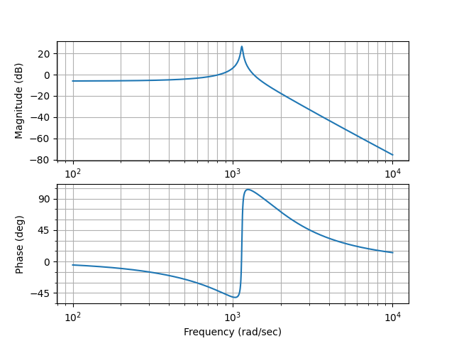
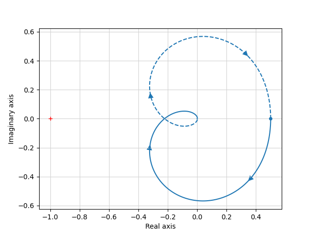
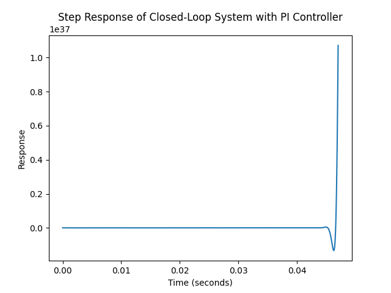

# System Control Analysis and Design

This repository contains the analysis and design process for a control system using various control theory methods and tools.

## Root Locus Method

We started by designing a control system to generate zero steady-state error for a closed-loop system using the root locus method.

### Code Snippet for Root Locus
```python
import control
import matplotlib.pyplot as plt

# Define the coefficients of the numerator and the denominator of the transfer function
num = [1.365e13]  # Coefficient of the numerator
den = [1, -3578, 6.707e06, 5.679e09, 2.73e13]  # Coefficients of the denominator

# Create the transfer function G(s)
G_s = control.tf(num, den)

# Assume default values for Kp and Ki based on the open-loop transfer function
Kp = 1 / abs(den[-1])
Ki = Kp / 10

# Create a PI controller with assumed Kp and Ki
C_s = control.tf([Kp, Ki], [1, 0])

# Combine the plant and the controller to get the open-loop transfer function
sys_open_loop = control.series(C_s, G_s)

# Plot the root locus of the system
plt.figure()
control.root_locus(sys_open_loop)
plt.title('Root Locus of System with PI Controller')

# Create the closed-loop system
sys_closed_loop = control.feedback(sys_open_loop, 1)

# Plot the closed-loop system's pole-zero map
plt.figure()
control.pzmap(sys_closed_loop, Plot=True, title='Pole-Zero Map of Closed-Loop System with PI Controller')

# Show the plots
plt.show()
```

## Bode and Nyquist Plots

Next, we analyzed the system's stability and robustness with the designed controller using Bode and Nyquist plots.

### Bode Plot


### Nyquist Plot


## Step Response Analysis

Lastly, we analyzed the step response of the closed-loop system with the PI controller to assess the performance and stability.

### Step Response


## Conclusion

Through these analyses, we aimed to evaluate the system's performance and stability with the designed controller, making adjustments as needed to ensure robust control.
